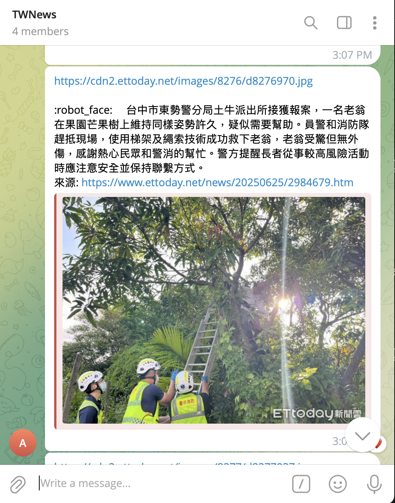

# NoAdsTaiwanNews
NoAdsTaiwanNews 是一個使用爬蟲爬取 Ettoday 新聞 (www.ettoday.net)
並使用llama cpp 模型產生新聞摘要發送至telegram 的研究project

## Installation
安裝 docker請參考[連結](https://www.docker.com/get-started/)

準備模型[下載連結](https://huggingface.co/audreyt/Breeze-7B-Instruct-64k-v0.1-GGUF/blob/main/Breeze-7B-Instruct-64k-v0.1-Q5_K_M.gguf) 並放置/LLM/models 資料夾底下

創建好telegram bot [教學文件](https://sendpulse.com/knowledge-base/chatbot/telegram/create-telegram-chatbot)

## Usage
1.先確認模型是否放入/LLM/models 下

範例是使用 Breeze-7B-Instruct-64k-v0.1-Q5_K_M.gguf 

可以依照個人喜好更換,並在main.py 檔修改名稱
```python
llm_model = LargeLanguageModel("./LLM/models/Breeze-7B-Instruct-64k-v0.1-Q5_K_M.gguf")
```

2.修改config.py

TOKEN : telegram bot 的token

GROUP_ID : 要發送的對話群組ID
```python
TOKEN = '<YOUR TG BOT TOKEN>'
GROUP_ID = '<CHAT GROUP ID>'
```
3. Build docker image. 在專案目錄底下輸入
```cmd
    docker build -t news:v1.0 .
```
4. Run docker image. 執行
```cmd
    docker run -d news:v1.0
```


## Ouput
